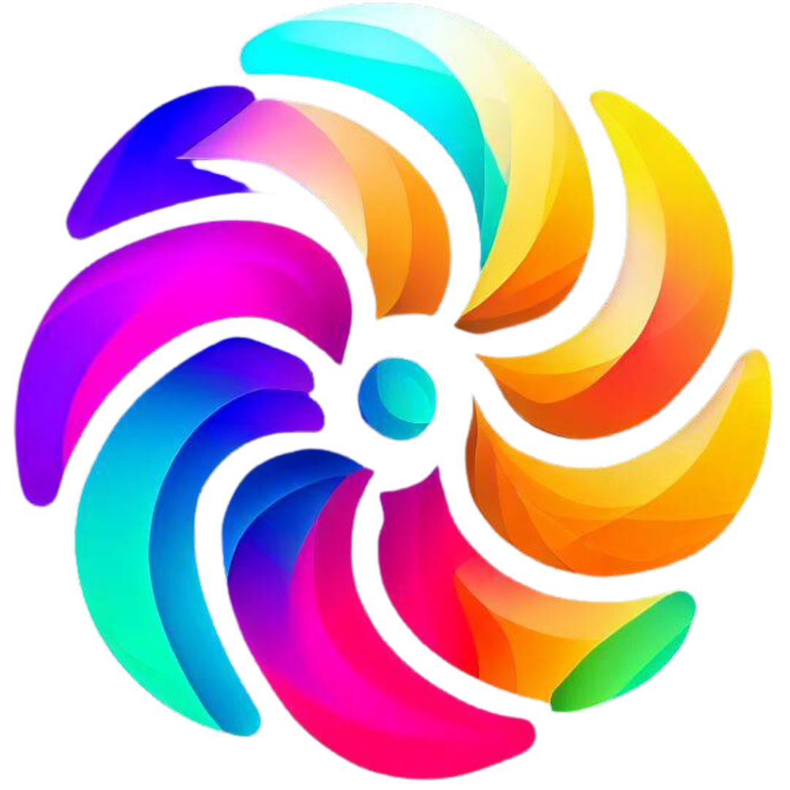

<h1 align="center">
  Color-Craft-GAN : Generative Adversarial Network based image enhancement
</h1>

  

  <strong>Colorize images using GAN!</strong>

## Overview

Our project aims to leverage the power of Generative Adversarial Networks (GANs) and deep learning techniques to colorize grayscale images. By training a GAN model on a dataset of grayscale and corresponding color images, we enable the automatic colorization of black-and-white photos. The model learns to generate vibrant and realistic color representations, bringing life to old and historical images. Our project combines advancements in deep learning, computer vision, and image processing to provide a user-friendly tool for enhancing and reviving monochrome images. With the simplicity of our solution, users can effortlessly convert grayscale images into captivating colorized versions, preserving memories and unlocking new possibilities in digital media.

## Features

✨ **Automatic Colorization**: Our project offers an automated solution to convert grayscale images to vibrant colorized versions using Generative Adversarial Networks (GANs).

✨ **Realistic Color Reproduction**: The GAN model is trained on a diverse dataset, enabling it to generate realistic and visually appealing color representations.

✨ **User-Friendly Interface**: Provides a user-friendly interface that allows users to easily upload grayscale images and obtain their colorized counterparts with a simple click of a button.

✨ **Preserving Historical Images**: By colorizing black-and-white or old photographs, our project helps to preserve historical imagery and breathe new life into cherished memories.

✨ **Versatile Application**: The colorization feature can be utilized in various domains, including photography, digital restoration, artistic creations, and enhancing visual content in multimedia projects.

## Project Architecture

The project architecture consists of two main components: a generator and a discriminator.

1. **Generator**: The generator takes grayscale images as input and aims to generate colorized versions of those images. It learns to map the low-dimensional grayscale representation to a high-dimensional color representation through a series of convolutional and upsampling layers. The generator is responsible for producing visually appealing and realistic colorizations.

2. **Discriminator**: The discriminator acts as a binary classifier and is trained to distinguish between real color images and the colorized images generated by the generator. It helps provide feedback to the generator by indicating how well the colorizations resemble real images. The discriminator aids in improving the quality and authenticity of the generated colorized outputs.

3. **Training Loop**: The training process involves an iterative loop where the generator and discriminator are trained in alternating steps. During each iteration, a batch of grayscale images is passed through the generator to obtain colorized versions. Real color images, along with the generated colorized images, are then fed to the discriminator for classification. The resulting losses are used to update the parameters of both the generator and discriminator using backpropagation and gradient descent algorithms.

4. **Dataset**: The model is trained on a dataset consisting of pairs of grayscale images and their corresponding color images. The dataset can be curated from various sources, including publicly available image datasets or custom-created datasets. It is essential to have a diverse and representative dataset to ensure the model's ability to generalize and produce accurate colorizations.[ Download from here](https://drive.google.com/drive/folders/1VDdLRZAsGp_jAhjZo7w49yMsRf4qS_8d?usp=drive_link)

## Getting Started

To get started with our project, follow these steps:

1. **Clone the Repository**: `git clone https://github.com/Asirwad/Color-Craft-GAN.git`

2. **Install Dependencies**: Install the required dependencies by running `pip install -r requirements.txt`.

3. **Prepare Your Dataset**: Organize your cover and secret images dataset and place them in the appropriate directories.

4. **Customize Configuration**: Modify the configuration files to set the desired parameters for the models and encryption algorithms.

5. **Train the Models**: Run the training script to train the CNN models and ESRGAN: `python train.py`.

6. **Explore the Scripts**: Utilize the provided scripts to hide, encrypt, reveal, and enhance images based on your specific requirements.

## Contributing

We welcome contributions from the open source community. If you find any issues or have suggestions for improvements, please feel free to open an issue or submit a pull request.

## Acknowledgements

We would like to acknowledge the following resources and libraries used in this project:

-  TensorFlow: [https://www.tensorflow.org/](https://www.tensorflow.org/)

## Contact

For any questions or inquiries, please contact us at [asirwadsali@gmail.com](mailto:asirwadsali@gmail.com).

